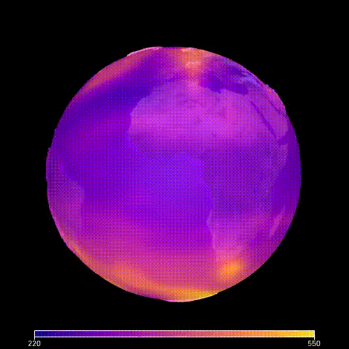
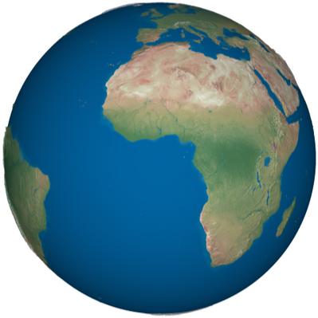
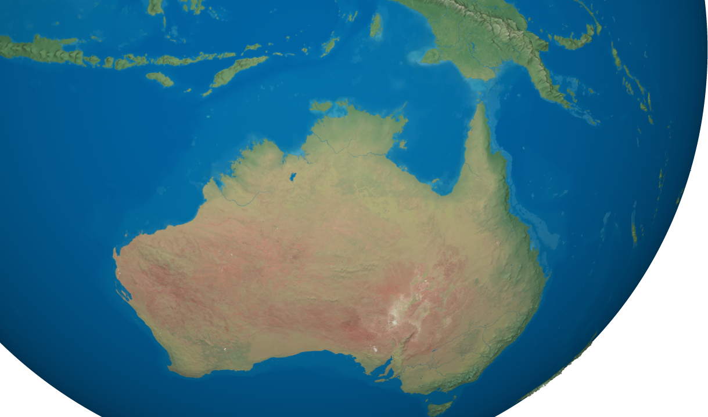
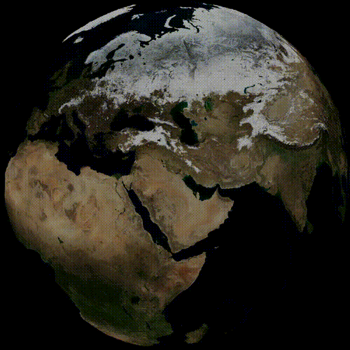
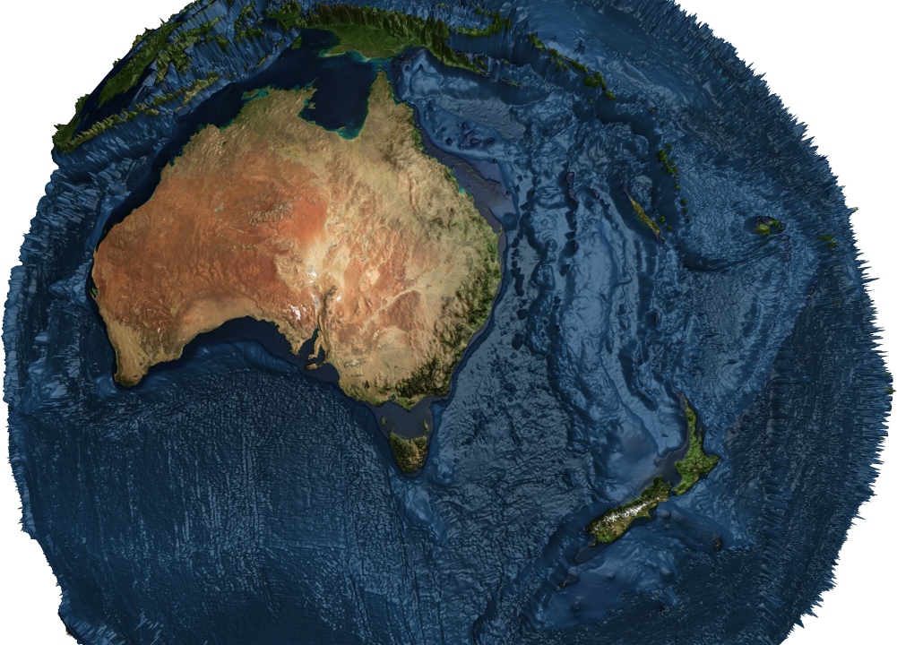
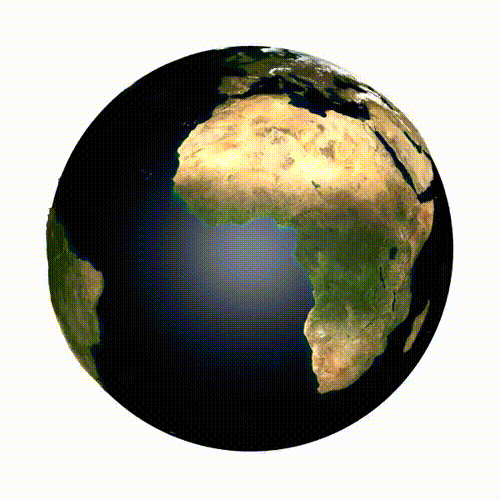
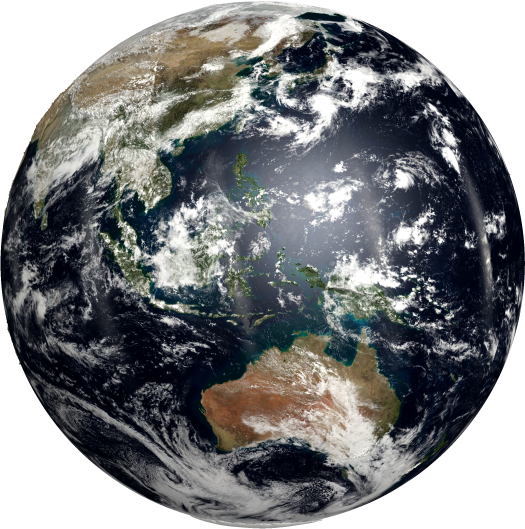
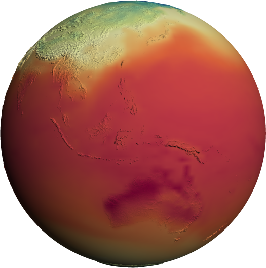
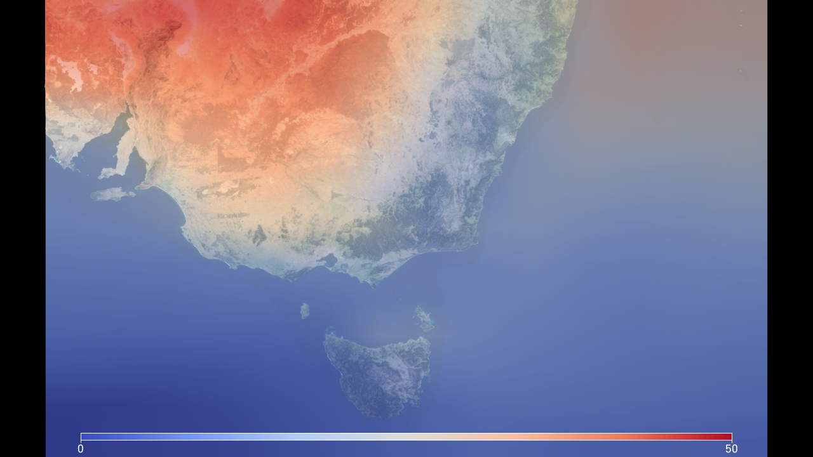

# ACCESS Visualisation Recipes

[](https://doi.org/10.5281/zenodo.14167706)

This repository hosts visualisation recipes developed for the ACCESS (Australian Community Climate and Earth-System
Simulator) project. These recipes enable users to easily visualise climate model data and perform analysis using
Python-based tools. The recipes are part of the Model Evaluation and Diagnostics (MED) team's efforts at ACCESS-NRI and
were initially developed by Owen Kaluza at ACCESS-NRI.

The recipes make use of the `accessvis` package to create interactive visualisations of climate data, including outputs
from ACCESS-ESM models and other CMIP6 datasets.


## Running the Examples

### Running on GADI (Australian Research Environment)

To run the examples from this repository on the Australian Research Environment (ARE), which is hosted on the GADI
system at the National Computational Infrastructure (NCI), follow the steps below to set up a JupyterLab session:

1. **Pre-requisites**:
    - You will need an NCI account. If you do not have one, sign up on the [MyNCI website](https://my.nci.org.au).
    - To run the examples on Gadi, join project `xp65`. Log in to [MyNCI website](https://my.nci.org.au) and request
      membership. Approval may take 1-2 days.

2. **Open ARE on Gadi**:
    - Go to the [Australian Research Environment](https://are-auth.nci.org.au/) website and log in with your NCI
      username and password.

3. **Start JupyterLab App**:
    - Select **JupyterLab** under *Featured Apps*.

4. **Configure JupyterLab session**:
    - Complete the following fields:
        - **Walltime**: Set to `4` hours for the hackathon or your session's duration.
        - **Queue**: Select `gpuvolta`.
        - **Compute Size**: Select `1xGPU (1 gpu, 12 cpus, 95G mem)`.
        - **Project**: Use your research project, e.g., `xp65`.
        - **Storage**: Add the storage paths:
          ```
          scratch/xp65 + gdata/xp65...
          ```
        - **Module directories**: Add:
          ```
          /g/data/xp65/public/modules
          ```
        - **Modules**: Add the environment:
          ```
          conda/access-vis-0.1
          ```

5. **Launch your JupyterLab session**:
    - After configuring the session, click `Launch` and wait for the JupyterLab instance to be ready.
    - Once started, click `Open JupyterLab` to begin working with the recipes.

---

### Alternative (Not on Gadi)

If you're not running on Gadi, you can still use the recipes by installing the `accessvis` package locally. To do this,
run the following command to install the package via `pip`:

```bash
pip install accessvis
```

Once the package is installed, you can proceed to use the visualisation recipes and interact with climate model data on
your local machine or other computational environments.

## Features and Examples

#### [Plot Ozone Concentration](./Examples/annual_maximum_ozone.ipynb)

Plot the maximum ozone concentration for each year (both historical and predicted).


#### [Basic Example](./00-Access-Vis-Overview.ipynb)

Learn the basics of using accessvis, including how to save images and interact with the Earth.


#### [Camera Controls](./01-Camera-Controls.ipynb)

Learn how to move and control the camera in accessvis.


#### [Change the Earth and Sun Based on Time](./02-Sun-And-Seasons.ipynb)

Change ice cover and greenery based on the time of year.
Move the sun based on the time of day/year.


#### [Bathymetry and Other Textures](./03-Texture-And-Bathymetry.ipynb)

Explore and exaggerate ocean depth and mountain height.
Or add wave textures and make other cosmetic improvements.


#### [Animations](./04-Animations.ipynb)

Learn how to make animations in access-vis.


#### [Overlay Images](./05-Overlaying-An-Image.ipynb)

Overlay additional data, such as satellite imagery of cloud or ice cover, on the Earth's surface.


#### [Visualise Global Temperature Data](./06-Plotting-High-Resolution-Data.ipynb)

Plot historical temperature data on the Earth's surface, apply colour schemes, and create interactive visualisations.


#### [Plot Temperature Over a Region](./07-Plotting-Over-A-Region.ipynb)

Improve performance by only plotting the relevant data over the required region.


## Acknowledgements

The visualisation recipes were initially developed by Owen Kaluza at ACCESS-NRI, with contributions from the Model
Evaluation and Diagnostics (MED) team at ACCESS-NRI. These tools are designed to make it easier for researchers to
visualise and analyse climate data outputs from the ACCESS models and CMIP6 datasets.

For more information or to contribute, please check out the documentation or open an issue in this repository.
