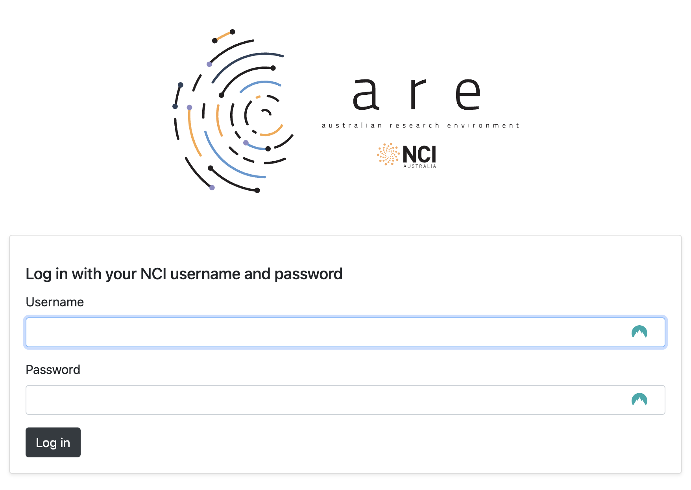

# ACCESS Visualisation recipes ARE JupyterLab setup guide
<p>Quick-start guide to setting up a JupyterLab session using the Australian Research Environment  to run the ACCESS Visualisation recipes.</p>

## 0. Pre-requisites

1. You will need an NCI account. If you do not have one, sign up on the [MyNCI website](https://my.nci.org.au).
2. To run the examples on Gadi, join project xp65. Log in to [MyNCI website](https://my.nci.org.au) and request membership. Approval may take 1-2 days.

## 1. Open ARE on Gadi
Go to the [Australian Research Environment](https://are-auth.nci.org.au/) website and login with your **NCI username and password**.

<p align="center"></p>


## 2. Start JupyterLab App
Click on `JupyterLab` under *Featured Apps* to configure a new JupyterLab instance. This option is also available under the *All Apps* section at the bottom of the page and the *Interactive Apps* dropdown located in the top menu.

<p align="center"></p>

## 3. Configure JupyterLab session
You will now be presented with the main JupyterLab instance configuration form. Please complete **only** the fields below - leave all other fields blank or to their default values.

1. **Walltime**: The number of hours the JupyterLab instance will run. For the hackathon, please insert a walltime of `4` hours.

<p align="center"></p>

2. **Queue**: Select `gpuvolta` from the dropdown menu.

<p align="center"></p>

3. **Compute Size**: Select `1xGPU (1 gpu, 12 cpus, 95G mem)` from the dropdown menu.

<p align="center"></p>

4. **Project**: Please use the research project to allocate compute cost.

<p align="center"></p>

5. **Storage**: This is the list of project data storage locations required to run the recipes. In ARE, storage locations need to be explicitly defined to access these data from within a JupyterLab instance. Do not forget to add the scratch and gdata storage of your research project.
```
scratch/xp65+gdata/xp65...
```

<p align="center"></p>

6. Click `Advanced options ...`
* Optional: You can check the box here to receive an email notification when your JupyterLab instance starts, but as we are running a relatively small instance, it will likely spin up quickly so this probably isn't necessary.</p>

7. **Module directories**: To load the required environment modules, please copy and paste the following. This is equivalent to using `module use` on the command line.
```
/g/data/xp65/public/modules
```

<p align="center"></p>

8. **Modules** To load the ESMValTool-workflow environment, please copy and paste the following. This is equivalent to using `module load` on the command line.
```
conda/access-med
```

<p align="center"></p>

9. Click `Launch` to start your JupyterLab instance.


<p align="center"></p>


## 4. Launch a JupyterLab session
Once you have clicked `Launch` the browser will redirect to the 'interactive sessions' page where you will see your JupyterLab instance details and current status which will look something like this:

<p align="center"></p>

Once the JupyterLab instance has started (this usually takes around 30 seconds), this status window should update and look something like the following, reporting that the instance has started and the time remaining. More detailed information on the instance can be accessed by clicking the `Session ID` link.

<p align="center"></p>

Click `Open JupyterLab`. This opens the instance in a new browser window where you can navigate to the location of the cloned tutorial files.

